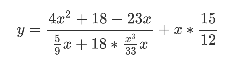

Перепишите данную математическую формулу, используя JavaScript. Программа должна запрашивать с помощью prompt значение X и выдавать соответсвующее значение Y в качестве ответа. Обратите внимание на приоритет операций (важно правильно расставить скобки).

В качестве проверки: при X = 10 программа должна вывести Y = 12.5344.